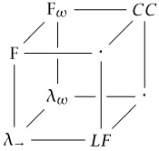

CS Theory Cheat Sheets 
===========

> A set of homemade cheat sheets on various [theoretical computer science](http://www.euclideanspace.com/software/computation/theory/index.htm) topics.

Contents
-------------------

* [Abstract Interpretation](output/abstract_interpretation_refcard.pdf)
* [Category Theory](output/category_theory_refcard.pdf)
* [Isabelle/HOL Proof Assistant](output/isabelle_hol_refcard.pdf)
* [Semantics of Programming Languages I (λ-calculus)]()
* [Semantics of Programming Languages II (confluence, termination)]()

Make Your Own
-------------------

The LaTeX cheat sheet has been made by [Winston Chang](http://www.stdout.org/~winston/latex). You can use the sources in `src`, make your own and generate with [TeX Live](https://www.tug.org/texlive/).

License
-------------------

All cheat sheets (except to those in `misc`) are distributed under the [CeCILL Free Software License Agreement 2.1](LICENSE).
